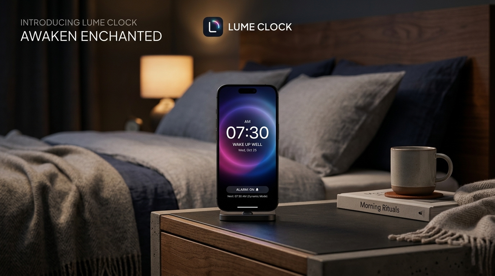

# Lume Clock Documentation

Welcome to the official developer and user documentation for **Lume Clock**. 

Lume Clock is a production-grade, highly responsive, color-ambient morning routine application designed for modern web browsers and native Android wrappers (built with Ionic Capacitor).

  

---

## 🚀 Core Pillars

### 1. High Performance Rendering (60fps)
Lume Clock uses zero-lag keyframe-driven CSS particle systems rather than intensive Canvas render-loops. This allows fluid weather backdrops (Midnight Star-twinkles, Dawn Rain-falls, Sunset Sparkles) to render flawlessly at 60fps even on low-tier mobile hardware.

### 2. Physical Gesture Engine
Using spring-snapping structures from `motion`, Lume Clock features a tactile swipe-to-activate panel. 
*   **Swipe Right:** Schedules a 5-minute snooze.
*   **Swipe Left:** Stops and dismisses the alarm.

### 3. Absolute Privacy
Lume Clock collects **zero personal information**. It operates entirely on-device, saving user configurations in local cache storage, meaning no database sync lag or telemetry overhead.

---

## 📂 Documentation Directory

To help you get the most out of your application, we have organized our documentation into the following dedicated guides:

*   **[Installation Guide](./installation)** — How to download, transfer, and sideload the release APK directly onto any Android device.
*   **[Play Store Submission](./playstore)** — A detailed breakdown of Google Play Console parameters, image dimensions, and exact questionnaire answers.
*   **[Privacy Policy](./privacy-policy)** — Official data safety and permission declaration texts.
*   **[Terms of Service](./terms-of-service)** — License agreements and liability waivers.
